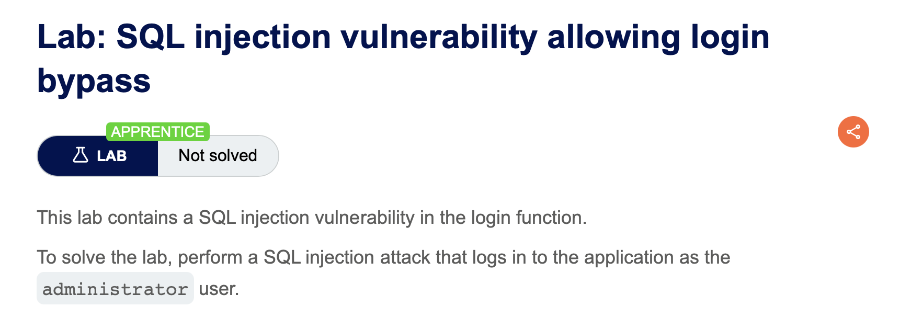

# portswigger-websecurity-academy

Writeups based on PortSwigger Web Security Academy Labs.

## Lab description



## Summary

A SQL injection vulnerability in the password parameter allows an attacker to bypass authentication by injecting a boolean condition that always evaluates to TRUE.

## Affected Function

- Login endpoint
- Parameter: `password`
- Known USERID: `administrator`

## Steps

### Query

The query used in the lab to authenticate user look something like

```sql
SELECT users WHERE userid = '<USERID>' AND password = '<PASSWORD>';
```

### Bypass Authentification

By injecting the payloard below into the password filed, the login condition is forced to evaluate to TRUE.

`' OR 'a'='a`

### Root Cause

The application constructs SQL queries for authentication by directly concatenating user input into the WHERE clause.
Injecting `'OR 'a' = 'a` forces the conditional expression to always evaluate to TRUE, bypassing the intended authentication logic.
