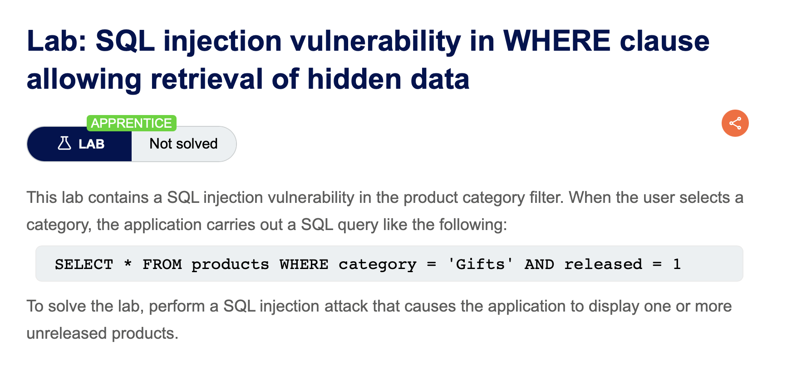

# portswigger-websecurity-academy

Writeups based on PortSwigger Web Security Academy Labs

##Lab description

## Steps

### Confirm vulnerable parameter

The vulnerable parameter can be identified by injecting a single quotation mark (`'`) and two quotation marks (`''`) into the parameter value and comparing the application responses. 
The affected parameter is `category`.

### Find 'normal' and 'error' statements

When a single quotation mark (`'`) is injeced, the application returns an error response.
In contrast, injecting two quotation marks (`''`) results in a normal response.
By injecting a boolean condition such as `OR 'a'='a'` into the vulnerable parameter, the condition always evaluates to TRUE, causing the application to return hidden data.

## Root Cause

The application constructs SQL queries by directly concatenating user-supplied input into the WHERE clause.
When the condition `category=' OR 'a'='a` is injected, the expression `'a'='a'` always evaluates to TRUE, causing the WHERE clause to return all rows.
As a result, data that is normally hidden becomes visible.
